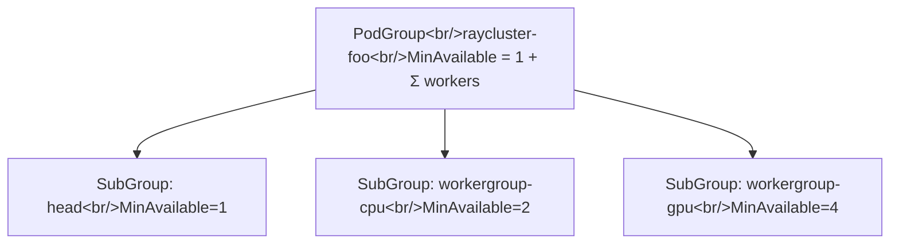

# Declarative PodGrouping for Arbitrary CRDs via Karta

Tracking issue: [#1527](https://github.com/NVIDIA/KAI-scheduler/issues/1527)

## Motivation

KAI's pod-grouper currently resolves a workload to a `Grouper` plugin via a static GVK table in [`pkg/podgrouper/podgrouper/hub/hub.go`](../../../../pkg/podgrouper/podgrouper/hub/hub.go). Each new workload kind (PyTorchJob, RayCluster, JobSet, MPIJob, LeaderWorkerSet, Grove PodCliqueSet, Dynamo, …) requires:

- A new Go plugin under `pkg/podgrouper/podgrouper/plugins/...`
- An entry in the hub's GVK table
- Per-CRD `+kubebuilder:rbac` markers
- Tests
- A KAI release before the user can consume it

For CRDs that are not in the hub, `DefaultGrouper.GetPodGroupMetadata` produces a flat `MinAvailable: 1` PodGroup with no SubGroups — effectively no gang scheduling and no topology awareness.

The k8s AI/batch ecosystem keeps shipping new CRDs (Kubeflow Trainer v2, JobSet variants, NVIDIA Dynamo, Grove, Milvus, plus internal/proprietary ones). The scheduler should not be the bottleneck for supporting them.

## Goals

- Allow arbitrary CRDs to participate in gang scheduling **without writing or merging Go code** into KAI.
- Reuse the structural description provided by [Karta](https://github.com/run-ai/karta) (Apache-2.0) so KAI does not invent its own DSL.
- Produce a full `Metadata.SubGroups` tree (parent/child, per-SubGroup `MinAvailable`, per-SubGroup topology) — equivalent expressiveness to the existing in-tree `grove` and `kubeflow/pytorch` plugins.
- Be opt-in. The existing in-tree plugins remain the source of truth for kinds the hub already knows about.

## Non-goals

- Replacing existing in-tree plugins. Karta-described kinds are a fallback for CRDs the hub does not match.
- Defining new scheduling primitives in KAI. Topology levels, `MinSubGroup`, etc. are layered onto Karta CRs via KAI-side annotations rather than baked into Karta's schema (see [Topology and KAI-only fields](#topology-and-kai-only-fields)).
- Translating Karta `optimizationInstructions` that have no analogue in KAI. Unsupported instructions are ignored with a warning event.

## Background

### Current pod-grouper structure

```
pkg/podgrouper/
├── pod_controller.go          # watches Pods, walks owners up to top-owner, dispatches by GVK
└── podgrouper/
    ├── hub/hub.go             # GVK -> Grouper table (static)
    └── plugins/
        ├── grouper/interface.go
        ├── defaultgrouper/    # MinAvailable=1, no SubGroups
        ├── grove/             # produces SubGroup tree from PodGang spec
        ├── kubeflow/pytorch/  # produces master + segmented worker SubGroups
        ├── jobset/, ray/, ...
        └── skiptopowner/      # delegates to a different grouper for wrapper CRDs
```

The `Grouper` interface is small:

```go
type Grouper interface {
    Name() string
    GetPodGroupMetadata(
        topOwner *unstructured.Unstructured,
        pod *v1.Pod,
        otherOwners ...*metav1.PartialObjectMetadata,
    ) (*podgroup.Metadata, error)
}
```

`Metadata` already supports a hierarchical `SubGroups []*SubGroupMetadata` with optional `Parent`, per-SubGroup `MinAvailable`, and per-SubGroup `TopologyConstraints` ([`pkg/podgrouper/podgroup/metadata.go`](../../../../pkg/podgrouper/podgroup/metadata.go)). A declarative plugin needs only to populate this struct from a CR.

### What Karta provides

Karta is a CRD + Go library that describes the structure of a workload type. Relevant pieces:

- `rootComponent` — the top-level GVK + status field paths
- `childComponents[]` — owned resources (Deployment, StatefulSet, Job, custom kinds), each with:
  - `podTemplatePath` — jq path to the pod template inside the parent
  - `scaleDefinition` — paths to `replicas` / `minReplicas` / `maxReplicas`
  - `instanceIdPath` — splits a multi-instance child into one logical group per instance
  - `podSelector` — labels that identify pods belonging to this component
- `optimizationInstructions.gangScheduling.podGroups[]` — declares which components form a pod group, with `members[].componentName` and grouping keys

Karta ships pre-built definitions for JobSet, PyTorchJob, RayCluster/Job, KServe InferenceService, Knative, MPIJob, NIM Service, LeaderWorkerSet, Milvus, NVIDIA Dynamo. The Go API lives at `github.com/run-ai/karta/pkg/{api,instructions,resource}` and does not depend on KAI.

## Design

### High-level flow

```mermaid
flowchart LR
    Pod[Pod created] --> Walk[pod_controller<br/>walk owner refs]
    Walk --> Hub[PluginsHub.GetPodGrouperPlugin&#40;GVK&#41;]
    Hub --> Match{In-tree<br/>plugin?}
    Match -- yes --> InTree[Existing plugin<br/>e.g. grove, pytorch]
    Match -- no --> KartaIdx{Karta CR<br/>covers GVK?}
    KartaIdx -- yes --> KartaPlugin[KartaGrouper]
    KartaIdx -- no --> Default[DefaultGrouper<br/>MinAvailable=1]
    InTree --> PG[PodGroup metadata]
    KartaPlugin --> PG
    Default --> PG
```



The new component is **`KartaGrouper`**. It implements `Grouper` and is consulted before the default fallback.

### Plugin registration

`PluginsHub.GetPodGrouperPlugin` ([`hub.go:71`](../../../../pkg/podgrouper/podgrouper/hub/hub.go)) currently checks the static map, then a version wildcard, then returns the default. The change is:

1. Static in-tree map (unchanged) — wins first.
2. **Karta index** — a `map[GVK]*kartaapi.Karta` rebuilt from a `Karta` CR informer.
3. Default grouper.

```go
func (ph *DefaultPluginsHub) GetPodGrouperPlugin(gvk metav1.GroupVersionKind) grouper.Grouper {
    if g, ok := ph.customPlugins[gvk]; ok { return g }
    gvkAny := gvk; gvkAny.Version = "*"
    if g, ok := ph.customPlugins[gvkAny]; ok { return g }

    // NEW: declarative fallback
    if ph.kartaGrouper != nil && ph.kartaGrouper.Covers(gvk) {
        return ph.kartaGrouper
    }
    return ph.defaultPlugin
}
```

`HasMatchingPlugin` is updated symmetrically so `pod_controller` still walks owner refs to a covered top-owner.

### KartaGrouper

```go
type KartaGrouper struct {
    *defaultgrouper.DefaultGrouper
    client client.Client
    index  *kartaIndex // GVK -> *kartaapi.Karta, fed by an informer
}

func (kg *KartaGrouper) Name() string { return "Karta Grouper" }

func (kg *KartaGrouper) Covers(gvk metav1.GroupVersionKind) bool { ... }

func (kg *KartaGrouper) GetPodGroupMetadata(
    topOwner *unstructured.Unstructured, pod *v1.Pod, _ ...*metav1.PartialObjectMetadata,
) (*podgroup.Metadata, error) {
    karta := kg.index.Lookup(topOwner.GroupVersionKind())
    base, err := kg.DefaultGrouper.GetPodGroupMetadata(topOwner, pod)
    if err != nil { return nil, err }

    tree, err := buildSubGroupTree(karta, topOwner)  // resolves jq paths against the live CR
    if err != nil { return nil, err }

    base.SubGroups = tree.SubGroups
    base.MinAvailable = tree.MinAvailable
    applyTopologyFromAnnotations(base, topOwner.GetAnnotations())
    return base, nil
}
```

The plugin reuses `DefaultGrouper` for queue/priority/preemptibility/owner exactly like `grove` and the kubeflow distributed groupers do today.

### Mapping Karta → KAI metadata

| Karta concept | KAI field |
|---|---|
| `rootComponent` GVK | matches `topOwner` — used for `Owner`, `Name`, top-level annotations/labels |
| `childComponent` (single-instance) | one `SubGroupMetadata` |
| `childComponent` with `instanceIdPath` | one `SubGroupMetadata` per instance, sharing a parent |
| `childComponent.ownerRef` parent component | `SubGroup.Parent` |
| `scaleDefinition.minReplicas` (fallback `replicas`) | `SubGroup.MinAvailable` |
| `gangScheduling.podGroups[].members[].componentName` | restricts which components become SubGroups (others may be excluded from the gang) |
| `podSelector` + the live pod's labels | populates `SubGroup.PodsReferences` for the firing pod |
| `optimizationInstructions.gangScheduling.minMember` (top-level) | `Metadata.MinAvailable`; if absent, sum of child `MinAvailable` |

### Pod → SubGroup attribution

When a pod fires the reconciler, only that pod's `Name` is added to the matching SubGroup's `PodsReferences` — same pattern as `pytorch_grouper.go` (see `buildWorkerSubGroups`). The matching component is the first `childComponent` whose `podSelector` matches the pod's labels. If multiple match, the deepest in the ownership tree wins; if none match, the pod gets a default-grouper SubGroup so it is at least scheduled.

### SubGroup tree example

A Karta CR for `RayCluster` (head + worker groups) produces:



The same flow applies to PyTorchJob, JobSet, MPIJob, etc. — Karta already ships definitions for these. Whether to migrate any in-tree plugin to Karta is **out of scope** for this design.

### Topology and KAI-only fields

Karta's `optimizationInstructions` does not encode KAI's topology levels (`PreferredTopologyLevel`, `RequiredTopologyLevel`, `Topology`) or `MinSubGroup`. Two paths considered:

- **(A) Upstream:** extend Karta's schema to carry these. Pro: clean. Con: depends on Karta release cadence; couples Karta to KAI semantics that other consumers don't need.
- **(B) Annotation-layered (preferred):** the `KartaGrouper` reads KAI annotations off the workload CR and the Karta CR, the same way `defaultgrouper` reads `kai.scheduler/topology*` today ([`default_grouper.go:87`](../../../../pkg/podgrouper/podgrouper/plugins/defaultgrouper/default_grouper.go)). Annotations on the Karta CR set per-component defaults; annotations on the workload CR override per-instance. No upstream changes required.

This design adopts **(B)**. Recognized annotations:

| Annotation | Scope | Effect |
|---|---|---|
| `kai.scheduler/topology` | workload CR or Karta CR | sets `Metadata.Topology` |
| `kai.scheduler/topology-required-placement` | workload CR or Karta CR | sets `Metadata.RequiredTopologyLevel` |
| `kai.scheduler/topology-preferred-placement` | workload CR or Karta CR | as above |
| `kai.scheduler/karta.<componentName>.topology-required-placement` | Karta CR | sets the SubGroup-level topology constraint for that component |
| `kai.scheduler/karta.<componentName>.min-sub-group` | Karta CR | sets `SubGroup.MinSubGroup` once that field lands (see [min-subgroups](../min-subgroups/README.md)) |

### RBAC

The hub's static markers grant `get;list;watch` per CRD ([`hub.go:46-60`](../../../../pkg/podgrouper/podgrouper/hub/hub.go)). A declarative plugin cannot regenerate these at compile time. Two options:

- **(A) Wide ClusterRole** — grant `get;list;watch` on `*` resources at install time. Simple, but expands KAI's blast radius.
- **(B) Karta-aware operator** (preferred) — the `operator` component reconciles `Karta` resources by maintaining a generated `ClusterRole` (`kai-podgrouper-karta`) whose rules mirror the GVKs declared by present `Karta` CRs. The pod-grouper consumes this role via aggregation (`rbac.authorization.k8s.io/aggregate-to-podgrouper: "true"`).

Option (B) keeps the principle of least privilege and reuses the existing operator's reconcile-CRDs pattern. RBAC narrows or widens automatically as `Karta` CRs are added or removed.

### CR discovery and hot-reload

The `KartaGrouper` runs an informer on `Karta` CRs (cluster-scoped, per Karta's spec). On change:

1. Rebuild `index map[GVK]*kartaapi.Karta`.
2. Update the aggregated ClusterRole (operator side).
3. Re-resolve any Pods whose previous reconcile produced no PodGroup because the CRD was unknown — done by emitting a synthetic enqueue for owning workloads of that GVK.

Workload kinds matched by the in-tree map are **not** replaced even if a `Karta` exists — the static map always wins. A Karta CR for an in-tree kind is logged as overridden and ignored.

### Skip-top-owner interaction

`skiptopowner` is used for wrapper CRDs (Argo `Workflow`, Kubeflow `TrainJob`, RunAI workload kinds, NVIDIA `DynamoGraphDeployment`) where the real grouping target is a child resource ([`hub.go:294-327`](../../../../pkg/podgrouper/podgrouper/hub/hub.go)). The Karta model already encodes "the real group lives in this child" via `childComponents[].ownerRef`, so:

- A Karta CR may declare a wrapper kind whose gang `members[]` only reference deeper components. The grouper walks ownership to that component and produces SubGroups from it — equivalent behavior to `skiptopowner` without an extra plugin.
- If both an in-tree `skiptopowner` entry and a `Karta` exist for the same GVK, the in-tree entry wins.

### Configuration / opt-in

A new flag on the pod-grouper:

```
--enable-karta-grouper=false   # default off until the feature is stable
```

When the flag is off, `kartaGrouper` is `nil` and behavior is unchanged. When on, the operator deploys the additional `Karta` CRD and the aggregated ClusterRole; the pod-grouper starts the informer and registers the plugin.

The Helm chart gains a value:

```yaml
podgrouper:
  declarativeGrouper:
    enabled: false
```

## Test plan

- **Unit tests** — `karta_grouper_test.go` covering: single-component, multi-component with parent links, multi-instance components (RayCluster worker groups), pods that match no component, gang `minMember` override.
- **Integration tests** — under `pkg/podgrouper/...` envtest suite: install a `Karta` CR for a synthetic CRD, create a pod owned by that CRD, assert `PodGroup` shape.
- **E2E** — one suite under `test/e2e/suites/declarative-grouping/` that:
  1. Installs Karta's pre-built JobSet definition,
  2. Creates a `JobSet`,
  3. Asserts the produced PodGroup matches what the in-tree `jobsetplugin` would produce, with the in-tree plugin temporarily disabled.

## Migration / backward compatibility

- Default off. Existing clusters see no change.
- When enabled, in-tree plugins win on overlap; no existing workload's PodGroup shape changes.
- No CRD changes to KAI's own APIs (`PodGroup`, `Queue`, `BindRequest`).

## Open questions

1. **Karta versioning.** What's the compatibility contract between KAI and Karta API versions? Vendor or Go-module-pin?
2. **Per-component preemptibility / priority.** Karta has no field for these. Annotation overlay only, or do we want to push into Karta upstream?
3. **Status reporting.** Should KAI write back into a Karta CR's `status` (e.g. "applied to PodGroup X")? Probably no — keeps Karta a passive description.
4. **Multi-tenant Karta CRs.** Karta is cluster-scoped; should namespace-scoped overrides be supported, or is cluster-wide always sufficient?
5. **Failure mode when Karta CR is malformed.** Fail closed (no PodGroup, pod stays Pending) or fall back to `DefaultGrouper`? Leaning fall-back-with-event.

## Future enhancements

- Surface the resolved Karta plugin choice on the `PodGroup` as an annotation (`kai.scheduler/grouper: karta`) for debuggability.
- Allow Karta CRs to be ConfigMap-sourced for air-gapped or GitOps-only setups that prefer not to install a third-party CRD.
- Migrate selected in-tree plugins (e.g. JobSet, MPIJob) to Karta-defined definitions once parity is proven, shrinking the static hub.
