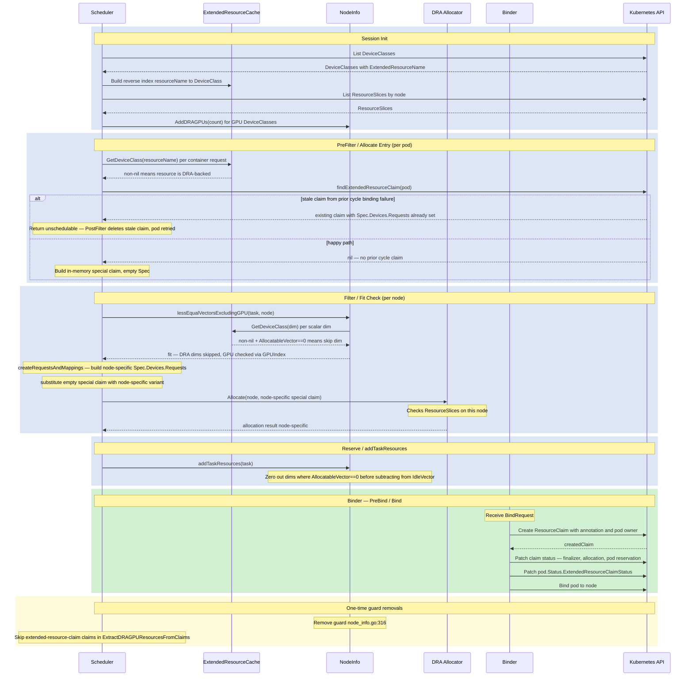

<!--
Copyright 2026 NVIDIA CORPORATION
SPDX-License-Identifier: Apache-2.0
-->

# DRA-Backed Extended Resources

*Status: Draft*

Related: [KEP-5004](https://kep.k8s.io/5004) (alpha v1.34, beta-on-by-default v1.36, GA v1.37)

## Motivation

Dynamic Resource Allocation (DRA) is the upstream path for managing GPU and other accelerator devices going forward. Cluster administrators who migrate device management to a DRA driver today break every existing workload that uses the classic extended-resource syntax (`nvidia.com/gpu: 2`), because DRA-only nodes carry no `nvidia.com/gpu` entry in `node.Status.Allocatable`.

KEP-5004 solves this at the Kubernetes level: a DeviceClass can declare an `ExtendedResourceName`, and the scheduler synthesizes a special ResourceClaim for pods that use that name, routing allocation through the DRA machinery while the pod spec stays unchanged.

KAI needs to support this flow so that workloads using extended-resource syntax can be scheduled onto DRA-managed nodes without modification, and so quota, fairshare, and preemption accounting remain correct throughout.

## Goals / Non-Goals

**Goals**

- Accept `nvidia.com/gpu: N` on pods targeting DRA-only nodes, with correct quota, fairshare, fit, and preemption accounting.
- Accept other DRA-backed extended resources on pods targeting DRA-only nodes (allocation via the DRA allocator; fit delegated to the allocator rather than KAI's vector check).
- Work for any extended resource name without requiring changes to workload APIs or PodGroup schemas.

**Non-Goals**

- Quota and fairshare accounting for non-GPU DRA-backed extended resources (capacity injection from ResourceSlices deferred to a follow-up; GPU accounting is in scope because KAI's existing GPU vector is used cluster-wide for fairshare and preemption).
- Fractional / GPU-sharing requests on DRA-backed extended resources (phase 2; the existing DRA consumable-capacity path handles that separately).
- MIG resources via DRA extended-resource bridge (can be added when a DeviceClass → MIG-profile mapping is defined upstream).

## Overview



## Design

Most of the infrastructure for this feature is already in place. The table below summarises what exists today:

| Layer | Existing mechanism |
|---|---|
| Node capacity (GPU) | `AddDRAGPUs` injects DRA GPU count into `AllocatableVector` / `IdleVector` at `GPUIndex`, counted from ResourceSlices in `cluster_info.go` |
| Task request (GPU) | `ExtractDRAGPUResourcesFromClaims` + `GpuRequirement.SetDraGpus` unifies DRA claim GPUs into `ResReqVector[GPUIndex]` |
| Task request (all other scalars) | Extended-resource container requests flow through `ResourceFromResourceList` → `scalarResources` map → `ResReqVector` via `ToVector` |
| Fit check (scalars) | `lessEqualVectorsExcludingGPU` does element-wise vector comparison for all dimensions including scalar extended resources |
| Quota / fairshare | `AcceptedResourceVector` / `ResReqVector` are consumed by proportion and capacity plugins — no resource-specific logic |
| DRA allocator | `pkg/scheduler/plugins/dynamicresources` already calls `structured.NewAllocator` and handles claim allocation / deallocation |
| API types | `DeviceClass.Spec.ExtendedResourceName`, `Pod.Status.ExtendedResourceClaimStatus`, and the `resource.kubernetes.io/extended-resource-claim` annotation are all present in `k8s.io/api@v0.35.4` |
| Helper library | `k8s.io/dynamic-resource-allocation/deviceclass/extendedresourcecache` (already a dependency) maintains the `extendedResourceName → DeviceClass` reverse index |

There is also an explicit temporary guard ([`node_info.go:316`](../../pkg/scheduler/api/node_info/node_info.go)) that rejects extended-resource GPU requests on DRA-only nodes, with a comment marking it for removal once this feature exists.

### Session Init

Two changes at session startup:

**Build `ExtendedResourceCache`** from the DeviceClass informer. The cache maintains a reverse index from `extendedResourceName → DeviceClass`, answering `GetDeviceClass(resourceName)` in O(1). It is built once per session and shared across the fit check and the dynamicresources plugin.

**Generalize `populateDRAGPUs`** to also handle `ExtendedResourceName`-mapped DeviceClasses. GPU extended resources are a special case: KAI's own GPU accounting (`GPUIndex` in the resource vector) is used for quota, fairshare, preemption, and GPU-sharing decisions across the entire scheduler, so it must remain correct when GPUs are managed by DRA.

The existing loop already counts all devices from node-local ResourceSlices with no selector evaluation — matching the behaviour of today's `populateDRAGPUs`. The same approach is kept here:

```
for each DeviceClass with ExtendedResourceName:
  if extendedResourceName already in node.Status.Allocatable: skip
  if extendedResourceName is a GPU resource:
    for each ResourceSlice on this node:
      gpuCount += len(slice.Spec.Devices)
  nodeInfo.AddDRAGPUs(gpuCount)
```

`HasDRAGPUs` is kept to drive the GPU-sharing guard until GPU sharing via DRA is implemented.

### PreFilter / Allocate Entry

The dynamicresources plugin's entry point (PreFilter / `allocateHandlerFn`) is extended to handle pods that have no `pod.Spec.ResourceClaims` but whose container requests include a DRA-backed extended resource.

**Detect DRA-backed requests** using `hasDeviceClassMappedExtendedResource`: iterate container resource requests and call `ExtendedResourceCache.GetDeviceClass(resourceName)` for each. A non-nil result means the resource is DRA-backed.

**Find or create the special claim.** `findExtendedResourceClaim` searches the API for a ResourceClaim annotated `resource.kubernetes.io/extended-resource-claim: true` and owned by this pod:

- **Happy path** (nil returned): no prior claim exists. Build an in-memory special claim named `<extended-resources>` with an empty `Spec` and a temporary UID. This claim is never written to the API server during scheduling.
- **Recovery path** (non-nil returned): a claim was created by the binder in a prior scheduling cycle but binding ultimately failed. Because the claim already has `Spec.Devices.Requests` set (node-specific from the prior attempt), it is stale. Return Unschedulable so PostFilter can delete the claim; the pod is re-queued and starts fresh on the next cycle.

The entry guard (`len(pod.Spec.ResourceClaims) == 0`) must be relaxed to also pass through pods that have DRA-backed extended resource requests.

### Filter / Fit Check

Two things happen per node:

**Fit check skip.** Upstream (`noderesources/fit.go:shouldDelegateResourceToDRA`) skips the vector fit check for any extended resource that is not in `node.Status.Allocatable` and has a DeviceClass mapping — the DRA allocator is the sole source of truth for those resources. KAI adopts the same approach in `lessEqualVectorsExcludingGPU`: for each scalar resource dimension, if `ExtendedResourceCache.GetDeviceClass(resourceName) != nil` and the resource is absent from the node's `AllocatableVector`, skip that dimension. GPU resources are not skipped here — they are checked normally via `GPUIndex`, which was injected by `populateDRAGPUs` at session init.

Note that `GetDeviceClass` is a cluster-wide lookup; it does not check whether the specific node has ResourceSlices for that DeviceClass. Node-specific device availability is determined by the DRA allocator in the next step.

**Special claim synthesis and allocation.** `filterExtendedResources` determines which resources need DRA allocation on this specific node by checking each resource against `node.Status.Allocatable`: resources absent from Allocatable are DRA-backed on this node; resources present are served by the device plugin and excluded from the special claim. This per-node determination matters in heterogeneous clusters where a resource may be device-plugin on some nodes and DRA-backed on others.

`createRequestsAndMappings` then builds the node-specific `Spec.Devices.Requests` — one `DeviceRequest` per (container, resource type) combination, named deterministically as `container-{i}-request-{j}`. A single special claim covers all DRA-backed extended resource types requested by the pod; no separate claim is created per resource type.

The empty in-memory special claim is substituted with this node-specific variant before being passed to `structured.NewAllocator`. The allocator checks the node's ResourceSlices and returns an allocation result if devices are available.

The upstream reference for `filterExtendedResources` and `createRequestsAndMappings` is `k8s.io/kubernetes@v1.35.4/pkg/scheduler/framework/plugins/dynamicresources/extendeddynamicresources.go`. These functions can be ported into KAI with minimal adaptation.

### Reserve / addTaskResources

When a pod with a non-GPU DRA-backed extended resource is assigned to a node, `addTaskResources` subtracts its request from `IdleVector`. Because `AllocatableVector` has 0 for resources not in `node.Status.Allocatable`, this drives `IdleVector` negative for those dimensions.

Negative `IdleVector` values are not merely cosmetic: `calcSubTreeFreeResources` and `calcNodeAccommodation` in the topology plugin sum `IdleVector` across nodes and compare it against job requests using the plain `ResourceVector.LessEqual` (no DRA-aware skip). Negative values would cause topology pre-filtering to falsely reject topology domains that the DRA allocator would have accepted.

Fix: in `addTaskResources` and `removeTaskResources`, before applying the vector to `UsedVector` / `IdleVector` / `ReleasingVector`, zero out any scalar dimension `i > PodsIndex` where `ni.AllocatableVector.Get(i) == 0`. This condition reliably identifies resources for which KAI delegates capacity decisions to the DRA allocator — no DeviceClass cache lookup is needed at this layer. CPU, memory, GPU, and pods always have non-zero allocatable on real nodes, so they are unaffected.

### BindRequest Extension

The scheduler communicates allocation results to the binder by creating a `BindRequest` CR in the API server. Existing DRA claims are carried in `BindRequestSpec.ResourceClaimAllocations`, keyed by `podClaim.Name` (the name of the entry in `pod.Spec.ResourceClaims`).

The special claim has no corresponding entry in `pod.Spec.ResourceClaims`, so the existing field cannot carry it. `BindRequestSpec` needs a new field:

```go
// ExtendedResourceClaimAllocation carries the scheduler's allocation result
// for the DRA-backed extended resource special claim, if any.
ExtendedResourceClaimAllocation *ExtendedResourceClaimAllocation `json:"extendedResourceClaimAllocation,omitempty"`
```

```go
type ExtendedResourceClaimAllocation struct {
    // Allocation is the AllocationResult from the DRA structured allocator.
    Allocation *v1.AllocationResult `json:"allocation"`
    // DeviceRequests is the Spec.Devices.Requests to set on the created ResourceClaim.
    DeviceRequests []v1.DeviceRequest `json:"deviceRequests"`
    // ContainerMappings is the container→request mapping for pod.Status.ExtendedResourceClaimStatus.
    ContainerMappings []v1.ContainerExtendedResourceRequest `json:"containerMappings"`
}
```

The scheduler populates `ExtendedResourceClaimAllocation` from the node-specific result stored during Filter before creating the BindRequest.

### Binder — PreBind / Bind

At bind time the binder reads `ExtendedResourceClaimAllocation` from the BindRequest and:

1. **Create ResourceClaim** in the API server using `GenerateName` (`<pod-name>-extended-resources-`), the `resource.kubernetes.io/extended-resource-claim: true` annotation, the pod as owner reference, and `DeviceRequests` as `Spec.Devices.Requests`.
2. **Patch claim status**: add the built-in finalizer, set `Status.Allocation` from `Allocation`, and add the pod to `Status.ReservedFor`.
3. **Patch `pod.Status.ExtendedResourceClaimStatus`**: record the generated claim name and `ContainerMappings` so the kubelet knows which devices to inject.
4. **Bind pod to node** via the standard BindRequest flow.

For idempotency, if `findExtendedResourceClaim` finds an existing claim for the pod (prior attempt that created the claim but failed to patch pod status), the binder skips claim creation and proceeds from step 2.

The upstream reference is `createExtendedResourceClaimInAPI` and `patchPodExtendedResourceClaimStatus` in `extendeddynamicresources.go`.

### One-time Guard Removals

**Remove guard at `node_info.go:316`**: this temporary guard rejects extended-resource GPU requests on DRA-only nodes. Once the fit-check skip and DRA allocator path are in place it is no longer needed; its comment already marks it for removal.

**Skip annotated claims in `ExtractDRAGPUResourcesFromClaims`**: pods bound via the extended-resource bridge have both a container extended-resource request and a generated ResourceClaim. Claims carrying the `resource.kubernetes.io/extended-resource-claim` annotation must be skipped in claim extraction so the GPU is counted only once — from the container request, not the claim.

## Component Summary

| Component | Change |
|---|---|
| `node_info.go` — `lessEqualVectorsExcludingGPU` | Skip scalar dimensions backed by a DRA DeviceClass and absent from `node.Status.Allocatable` |
| `node_info.go` — `addTaskResources` / `removeTaskResources` | Zero out scalar dimensions where `AllocatableVector[i] == 0` before applying to `UsedVector` / `IdleVector` / `ReleasingVector` |
| `cluster_info.go` — `populateDRAGPUs` | Generalize to handle GPU DeviceClasses with `ExtendedResourceName`; wire `ExtendedResourceCache` |
| `cluster_info.go` — session init | Build `ExtendedResourceCache` from DeviceClass informer |
| `dynamicresources` scheduler plugin | Detect extended-resource requests backed by DRA; synthesize and allocate in-memory special claim |
| `node_info.go` | Remove temporary guard at line 316 |
| `resource_info` / `dra_resource_utils.go` | Skip `extended-resource-claim`-annotated claims in claim extraction |
| `bindrequest_types.go` | Add `ExtendedResourceClaimAllocation` field to `BindRequestSpec` |
| binder `dynamicresources` plugin | Read `ExtendedResourceClaimAllocation` from BindRequest; create real ResourceClaim in API, patch pod status at bind time |

## Open Questions

- **Multi-resource extended resources**: a pod requesting multiple DRA-backed extended resource types produces a single special claim whose `Spec.Devices.Requests` contains one entry per (container, resource type) combination, named `container-{i}-request-{j}`. The allocator handles all resource types in a single `Allocate` call.
- **Binder idempotency**: if the ResourceClaim is created but the pod status patch fails, the binder must not create a second claim. Use deterministic naming (e.g., `<pod-name>-extended-resources-`) matching upstream, so a second attempt finds the existing claim via `findExtendedResourceClaim`.
- **Quota for generated claims**: generated claims should not count toward queue claim quotas (if any such limit is added). Filter by annotation.
