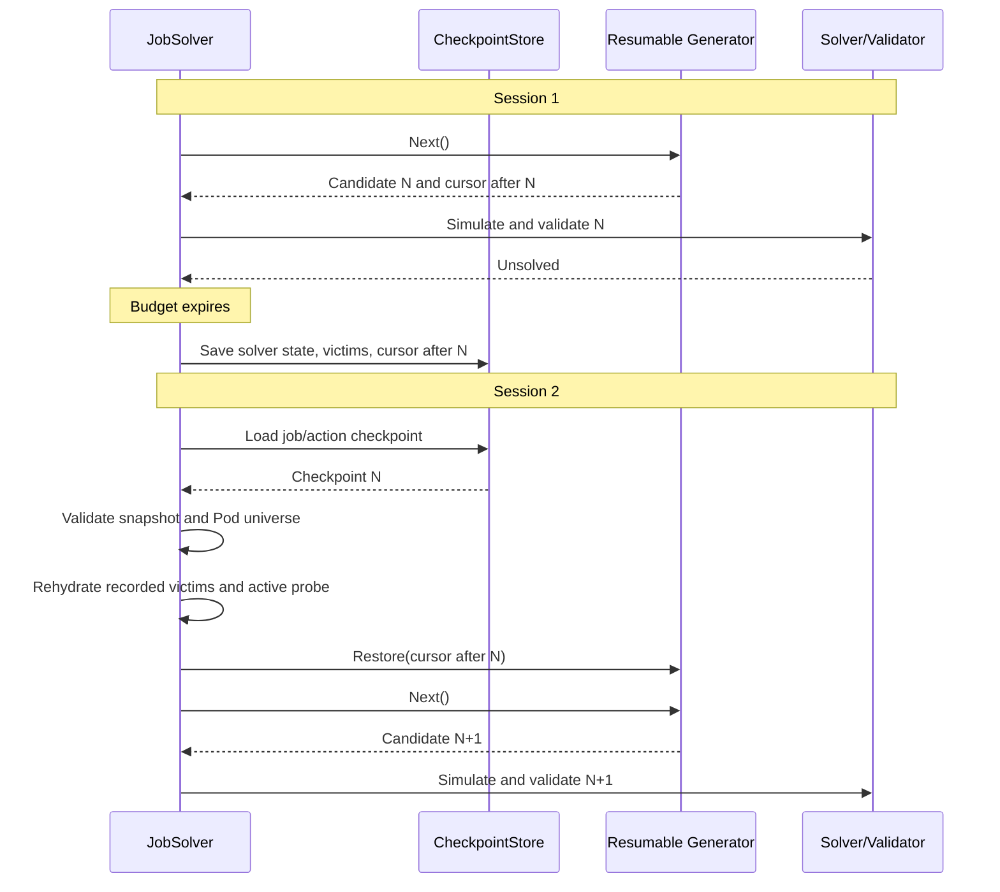

# Resumable Scenario-Generator Checkpoints

<!-- toc -->
- [Summary](#summary)
- [Motivation](#motivation)
  - [Goals](#goals)
  - [Non-Goals](#non-goals)
- [Proposal](#proposal)
  - [Limitations/Risks &amp; Mitigations](#limitationsrisks--mitigations)
- [Design Details](#design-details)
  - [Checkpoint Model and Cursor Contract](#checkpoint-model-and-cursor-contract)
  - [In-Tree Generator Cursors](#in-tree-generator-cursors)
  - [Checkpoint Lifecycle](#checkpoint-lifecycle)
  - [Input Validation](#input-validation)
  - [Budget Accounting](#budget-accounting)
  - [Configuration](#configuration)
  - [Store Admission and Cleanup](#store-admission-and-cleanup)
  - [Performance Effects](#performance-effects)
    - [Scale Model](#scale-model)
    - [Retained Memory](#retained-memory)
    - [Runtime Cost](#runtime-cost)
    - [Comparison with Fingerprint Replay](#comparison-with-fingerprint-replay)
  - [Monitoring](#monitoring)
  - [Test Plan](#test-plan)
- [Alternatives](#alternatives)
  - [Last-Scenario Fingerprint Replay](#last-scenario-fingerprint-replay)
<!-- /toc -->

## Summary

KAI Scheduler bounds reclaim scenario search, but a difficult job can spend every session rebuilding earlier probes and repeating candidates. This proposal stores compact solver state, recorded-victim bitmaps, and generator cursors so unchanged searches continue at their first unprocessed candidate. A bounded process-local store limits retained memory, while an incremental scheduling-state digest avoids full-cluster work during checkpoint load and save.

## Motivation

Bounded search protects scheduling latency, but restarting each session can spend every budget on candidates already rejected. At large scale, candidate construction alone may consume the deadline before new work begins. Issue [#1755](https://github.com/kai-scheduler/KAI-Scheduler/issues/1755) requires safe forward progress with small checkpoints.

### Goals

- Resume supported reclaim generators at their first unprocessed candidate.
- Restore recorded victims and binary-search bounds without rerunning earlier probes.
- Preserve budget semantics and reject checkpoints after input changes.
- Bound retained memory by configured job capacity and an internal byte limit.
- Avoid full-cluster work during checkpoint load and save.
- Preserve admitted jobs at capacity and expose checkpoint effectiveness.

### Non-Goals

- Persist checkpoints across scheduler process restarts.
- Make bounded search exhaustive or guarantee that a reclaim solution is found.
- Retain recorded-victim objects or solution statements across sessions.
- Checkpoint generators that do not implement direct resume.
- Eliminate all restore work; a generator may reconstruct state needed for its next candidate.
- Add a feature gate or durable checkpoint API.

## Proposal

One process-lifetime store is shared across sessions. Reclaim stores one entry per action and PodGroup UID containing binary-search bounds, snapshot-bound recorded-victim ordinals, interrupted probe and generator, validated inputs, and next generator position. On unchanged input, `JobSolver` rehydrates recorded victims, resumes its active probe, then restores the generator. Unsupported generators restart without checkpointing or fingerprint replay.

### Limitations/Risks & Mitigations

| Risk or limitation | Mitigation |
| --- | --- |
| A generator encodes or restores a cursor incorrectly. | Require conformance tests comparing uninterrupted and restored sequences at every position. |
| A victim bitmap is decoded against a different Pod universe. | Validate snapshot and universe fingerprints before decoding; any mismatch deletes the checkpoint. |
| The state digest omits an input affecting output. | Centralize canonical hashing and compare incremental digests with full reconstruction in tests. |
| Generator order or digest updates are nondeterministic. | Require deterministic ordering, canonical encoding, and one framework-owned mutation path. |
| Deep accumulated-state restoration is expensive. | Reconstruct only state required for the next candidate and measure restore latency. |
| Cluster churn invalidates checkpoints frequently. | Treat invalidation as required safety and expose its rate. |
| A third-party generator cannot resume. | Keep resume optional and run unsupported generators without checkpoints. |
| A scheduler restart loses progress. | Keep process-local persistence explicit; durable storage requires another design. |
| Deleted jobs occupy store capacity. | Sweep entries absent from the next session snapshot. |
| A cursor is corrupt or obsolete. | Version and validate cursor fields, delete the entry, and restart normally. |

## Design Details

### Checkpoint Model and Cursor Contract

```go
type ScenarioCheckpointKey struct {
    Action ActionType
    JobUID common_info.PodGroupID
}

type ScenarioCheckpoint struct {
    InputFingerprint       [32]byte
    PodUniverseFingerprint [32]byte
    GeneratorName          string
    GeneratorCursor        ScenarioGeneratorCursor
    SolverCursor           JobSolverCursor
    RecordedVictims        []byte
    StopReason             string
}

type JobSolverCursor struct {
    Phase  uint8
    Lo     uint32
    Hi     uint32
    ProbeK uint32
}
```

```go
const ScenarioGeneratorCursorDataSize = 32

type ScenarioGeneratorCursor struct {
    Version uint16
    Data    [ScenarioGeneratorCursorDataSize]byte
}

type ResumableScenarioGenerator interface {
    ScenarioGenerator
    Cursor() (ScenarioGeneratorCursor, bool)
    Restore(ScenarioGeneratorCursor) error
}
```

`RecordedVictims` is a dense bitmap over the snapshot's deterministic, UID-sorted Pod table. The solver cursor holds only its exponential-search or binary-search phase, bounds, and active probe. Set bits restore victim tasks in UID order and rebuild partial victim-job representatives by PodGroup UID. Consumers must treat both collections as sets. No scheduler objects or solution statements are retained.

The store validates both fingerprints before reading the bitmap. It then bounds-checks every set ordinal and resolves it through the current Pod table. A missing Pod or inconsistent PodGroup invalidates the checkpoint. This makes ordinal shifts safe: Pod addition, deletion, or replacement changes the universe fingerprint, so the old bitmap is never decoded against the new table.

`Cursor` identifies position after most recently emitted candidate and returns `false` before first emission. Solver records it only after candidate becomes unsolved, validator-rejected, or a known duplicate; emitted but unprocessed candidates never advance progress. Solved candidates delete their checkpoint.

`Restore` validates a cursor from same generator name and version, then positions next `Next()` call at its successor without calling `Next()` internally. Exact positions distinguish duplicate scenarios. Version `0` is invalid; semantic changes require a new version. Integers use big-endian encoding and unused bytes remain zero.

### In-Tree Generator Cursors

| Generator | Cursor state |
| --- | --- |
| `NodeLocalGreedy` | Victim-queue pop count, generator phase, and next node-local sub-scenario index. |
| `MultiNodeGang` | Victim-queue pop count, generator phase, sub-emitter `nextK`, and growth step. |

The pop count includes operations that skip recorded victims or requeue the remainder of an elastic victim job. With unchanged inputs, repeating those queue mutations reconstructs the same accumulated prefix without constructing earlier candidate scenarios.

`NodeLocalGreedy` resumes at the next sorted node index. `MultiNodeGang` recreates its sub-emitter at the recorded `nextK` and growth step. An index outside the reconstructed state invalidates the cursor.

### Checkpoint Lifecycle



Load validates the generator, cursor version, solver bounds, input, and Pod universe before rehydrating victims or restoring the generator. Mismatch, unsupported generator, or restore failure deletes the entry and restarts normally. Budget exhaustion saves the latest completed cursor with current solver state and victims; if no candidate completed after restore, the previous entry remains. Solution, full exhaustion, or missing job deletes it.

### Input Validation

The input fingerprint is:

```text
SHA-256(
    fingerprint-version,
    action,
    scheduling-state-digest,
    scheduling-policy-digest,
    pod-universe-digest,
    partial-pending-job-digest,
    feasible-node-membership-digest,
    generator-name,
    cursor-version
)
```

Fields use canonical, length-prefixed binary encodings. `fmt.Sprint`, Go map iteration order, and pointer identity are forbidden inputs.

The scheduling-state digest covers:

- PodGroup UID, queue, priority, preemptibility, and task membership;
- task UID, node name, status, resource request, and GPU requirement; and
- node name, idle resources, releasing resources, and Kubernetes resource version.

Each entity is hashed independently with a type-specific domain separator and UID. Entity hashes are combined into an order-independent multiset accumulator using unsigned addition modulo `2^256`, with an entity count for each domain. The final state digest hashes the accumulators and counts.

Snapshot construction also creates one UID-sorted Pod-pointer table and hashes its length-prefixed UIDs into the Pod-universe digest. The table provides stable bitmap ordinals without another lookup map. Its digest is part of the input fingerprint, so any Pod addition, deletion, or replacement invalidates the checkpoint before bitmap decoding. Changes to scheduling-relevant Pod fields invalidate through the scheduling-state digest.

Framework statement mutations subtract the old canonical entity hash and add the new one. Rollback uses the same helper to apply the inverse transition. Rebuilding a digest from the resulting snapshot must equal the incrementally maintained value.

The policy digest is computed after ordered plugin registration and covers generator order, enabled plugin configuration, and scenario-search budgets. Probe-local digests identify the pending task sequence and feasible-node membership. Checkpoint capacity does not affect search output and is excluded. Node content is already represented by the state digest.

### Budget Accounting

Action and job budgets begin according to the existing `JobSolver` contract. Load, validation, generator construction, and restore consume those outer wall-clock budgets. The solver checks both deadlines immediately before and after restore.

The generator budget begins only after restore succeeds. Previously processed candidates can therefore never consume it. Existing candidate-boundary checks apply once generation resumes.

If action or job time expires during restore, no new candidate begins and the old checkpoint remains unchanged. As with `Next()` and simulation, one restore call may finish after an outer deadline when it started before that deadline.

### Configuration

`SchedulingShard.spec.scenarioSearchCheckpoints.maxJobs` limits the number of jobs that may retain progress. It defaults to `32`; `0` disables checkpoint storage. Helm mirrors the field as `scheduler.scenarioSearchCheckpoints.maxJobs` and renders it into the default `SchedulingShard`.

```yaml
spec:
  scenarioSearchCheckpoints:
    maxJobs: 32
```

Valid values are `0..4096`. Setting `0` clears and disables the store. Lowering a positive limit does not evict existing entries; the store rejects new keys until its size falls below the new limit.

### Store Admission and Cleanup

The default capacity is 32 jobs. A fixed 4 MiB process-wide limit additionally bounds victim bitmaps for unusually large Pod universes.

```go
type ScenarioCheckpointSaveResult uint8

const (
    ScenarioCheckpointCreated ScenarioCheckpointSaveResult = iota
    ScenarioCheckpointUpdated
    ScenarioCheckpointRejectedCapacity
    ScenarioCheckpointRejectedMemory
)
```

`Save` reserves one full bitmap when admitting a key. It rejects an absent key when either configured job capacity or the bitmap-byte limit is full, but accepts updates to an existing key whose validated Pod universe is unchanged. It never evicts another job. This preserves progress for admitted jobs while preventing new jobs from consuming their capacity.

At session open, an `O(capacity)` sweep removes entries whose PodGroup UID is absent from the snapshot. Normal search removes entries when their job solves or their generator exhausts. A mutex protects the map, although normal scheduler action access is serial.

### Performance Effects

The following values are rough engineering estimates based on algorithmic work and scale-test object counts. They are not measurements or service-level objectives. Benchmarks must validate them before the feature graduates from experimental status.

#### Scale Model

The scale suite models eight GPUs per node and fills the cluster with one-GPU jobs:

| Cluster | Nodes | GPUs | Single-GPU jobs/Pods |
| --- | ---: | ---: | ---: |
| Large | 2,000 | 16,000 | 16,000 |
| Very large | 4,000 | 32,000 | 32,000 |

By default, only 32 jobs retain checkpoints. Cluster size affects each job's victim bitmap, while configured job capacity and the 4 MiB bitmap limit bound total retention.

#### Retained Memory

One entry contains two 32-byte fingerprints, a 34-byte generator cursor, compact solver bounds, scalar metadata, its action/job key, and one bit per Pod. Go alignment, map buckets, and retained UID bytes add overhead.

| Component | Rough additional retained memory |
| --- | ---: |
| Fixed metadata per checkpoint | 250–700 bytes |
| Victim bitmap at 16,000 Pods | 2 KiB per checkpoint; 64 KiB for 32 jobs |
| Victim bitmap at 32,000 Pods | 4 KiB per checkpoint; 128 KiB for 32 jobs |
| Estimated full store at 2,000 nodes | 0.1–0.25 MiB |
| Estimated full store at 4,000 nodes | 0.15–0.35 MiB |
| Process-wide victim-bitmap limit | 4 MiB |

The UID-sorted Pod-pointer table is snapshot-scoped, not duplicated per checkpoint. Its backing slice costs roughly 0.15 MiB at 16,000 Pods or 0.3 MiB at 32,000 Pods. Bitmap encoding locates victims by binary search rather than retaining an ordinal map. Restore working memory contains maps and slices referencing current victims, but they remain session-scoped; the store retains no scheduler objects.

#### Runtime Cost

The state digest adds `O(nodes + jobs + pods)` hashing while the snapshot is materialized. The Pod table adds one `O(pods log pods)` sort per snapshot; checkpoint load and save do not sort or traverse the cluster. Later entity changes update the state digest in constant time per entity.

| Operation | 2,000 nodes | 4,000 nodes | Complexity |
| --- | ---: | ---: | --- |
| State digest during snapshot construction | 10–100 ms/session | 20–200 ms/session | `O(nodes + jobs + pods)` once per snapshot |
| Build UID-sorted Pod table | 2–20 ms/session | 5–50 ms/session | `O(pods log pods)` once per snapshot |
| Checkpoint map load or save | Less than 100 microseconds | Less than 100 microseconds | Expected `O(1)` |
| Probe-local fingerprint for a large gang | 1–20 ms | 2–40 ms | `O(pending + victims + feasible nodes)` |
| Decode victim bitmap and rehydrate references | Less than 1–5 ms | Less than 2–10 ms | `O(pods + victims)` |
| Shallow cursor restore | Less than 1–10 ms | Less than 1–10 ms | Generator-dependent |
| Deep victim-prefix reconstruction | 100 ms–1 s | 200 ms–2 s | Proportional to the required victim prefix |

Incremental digest updates are expected to cost microseconds to low tens of microseconds per changed Pod, PodGroup, or node. Bulk simulation can change several entities, so profiles must measure accumulated cost and verify that rollback uses the same path.

Deep restore is not constant time. In-tree generators may repeat deterministic victim-queue mutations to rebuild the accumulated prefix. It still avoids constructing and hashing previous sub-scenarios and avoids their solver and validator calls. A 4,000-node worst-case restore may cost a small number of seconds, replacing replay that can consume the complete 30-second or two-minute generator budget.

#### Comparison with Fingerprint Replay

| Property | Last-scenario fingerprint replay | Direct generator cursor |
| --- | --- | --- |
| Retained memory at default capacity | Tens of KiB | Approximately 0.1–0.35 MiB at 2,000–4,000 nodes |
| Resume work | Regenerate and hash candidates `1..N` | Reconstruct required state and emit `N+1` |
| Per-session growth | `O(N)` in prior candidates | Proportional to state needed by the next candidate |
| Generator budget | Active while searching for cursor | Starts after successful restore |
| Duplicate scenarios | May match an earlier identical fingerprint | Cursor identifies an exact position |
| Validation | Full scans, formatting, allocations, and sorts | Snapshot digest plus probe-local hashing |
| Failure mode | May repeatedly expire before cursor | Retains cursor if an outer deadline expires during restore |

Fingerprint replay can work when simulation dominates and candidate reconstruction is cheap. At large scale, victim-queue work, filters, candidate construction, and hashing can themselves consume the budget without producing new simulation. Direct cursors retain the bounded-memory profile while making remaining restore cost explicit and observable.

### Monitoring

Add bounded-cardinality metrics without job, Pod, node, or cursor identifiers as label values:

- `scenario_search_checkpoints_total{operation,result}` counts loads, creates, updates, capacity rejections, invalidations, deletions, and sweeps.
- `scenario_search_checkpoint_entries` reports current store size.
- `scenario_search_checkpoint_bitmap_bytes` reports reserved bitmap memory.
- `scenario_search_checkpoint_restore_duration_seconds{generator,result}` measures restore duration and outcomes.
- `scenario_search_checkpoint_validation_duration_seconds{result}` measures input validation.
- `scenario_search_state_digest_duration_seconds{phase}` measures snapshot construction and incremental updates.

Restore errors also emit a bounded warning containing generator name, action, PodGroup namespace/name, and cursor version. Raw cursor bytes are not logged.

### Test Plan

- Test cursor encoding, invalid values, and uninterrupted-versus-restored sequences for both in-tree generators, including their accumulation and sub-scenario transitions.
- Add multi-session `JobSolver` coverage proving recorded victims and solver bounds are restored, earlier probes are skipped, first post-restore simulation is `N+1`, and completion or solution removes the checkpoint; keep existing invalid-input tests unchanged.
- Cover Pod addition, deletion, replacement, shifted ordinals, invalidation-before-decode, unsupported generators, restore failure, stale-job sweep, capacity rejection, existing-entry updates, and concurrent store operations.
- Verify the default 32-job limit, custom limits, disabled storage, limit reductions, and bitmap-byte rejection without eviction.
- Verify restore consumes action/job time but receives a fresh generator budget.
- Compare incremental digests with full reconstruction after allocate, evict, commit, rollback, and discard.
- At 2,000 and 4,000 nodes, compare `origin/main`, fingerprint replay, and direct cursors using identical seeds. Cover empty/full stores, hit/miss/invalidation, shallow/deep cursors, single-Pod reclaim, large gangs, and stable/changing snapshots.
- Record heap, RSS, snapshot/validation/restore latency, reclaim p50/p95/p99, CPU, allocations, and candidate counts.

## Alternatives

### Last-Scenario Fingerprint Replay

The prototype stores the last emitted scenario fingerprint. A new session recreates the generator and calls `Next()` from its beginning, suppressing solver and validator calls until it finds that fingerprint.

This is the current implementation. It is simple, works with the `Next()`-only interface, and retains only fixed-size data. It is not selected because it regenerates and hashes `1..N`, can exhaust its deadline before cursor discovery, can match an earlier duplicate fingerprint, and performs full-cluster validation scans. Because it stores neither solver bounds nor recorded victims, earlier successful probes must also run again; a short session can expire before reaching the saved probe.

Other alternatives:

| Alternative | Reason not selected |
| --- | --- |
| Retain live generators | Constant-time continuation retains old sessions, queues, scenarios, and scheduler objects; memory grows with active searches. |
| Serialize complete generator state | Payload grows with victims and nodes, couples storage to internal schemas, and must resolve stale objects. |
| Persist failed-scenario fingerprints | Exact sets grow with search width; Bloom filters may skip untried candidates; neither provides seeking. |
| Increase search budgets | Increases synchronous tail latency and still restarts after expiration. |
| Serialize complete `JobSolver` | Retaining statements and scheduler objects is memory-heavy and unsafe across snapshots; compact bounds and victim ordinals are sufficient. |
