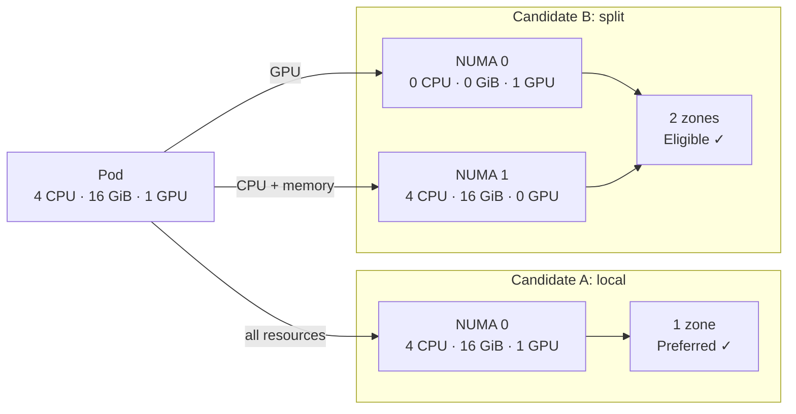
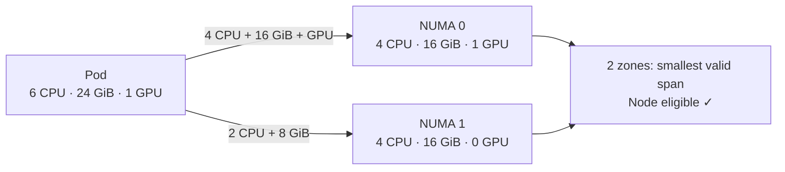
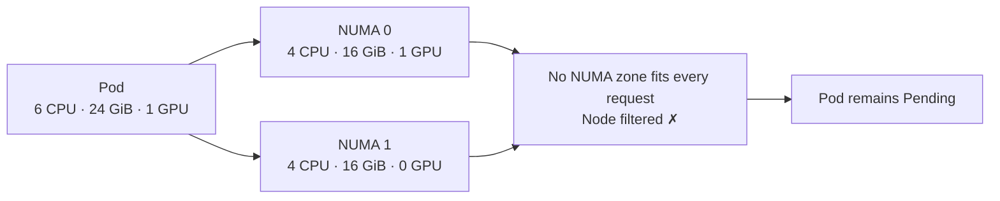

# NUMA-Aware Scheduling

KAI's NUMA plugin helps schedule workloads whose CPU, memory, GPUs, NICs, or other devices must be close to one another on a NUMA node. It reads per-node [`NodeResourceTopology`](https://github.com/k8stopologyawareschedwg/noderesourcetopology-api) (NRT) objects and predicts the kubelet Topology Manager's admission decision. The kubelet remains the authority for the final allocation.

This guide is for cluster administrators configuring nodes and researchers submitting topology-sensitive workloads.

## Prerequisites

Enable NUMA only on worker nodes with NUMA hardware and a device plugin that reports device topology. KAI needs all of the following:

1. Kubelet Topology Manager configured with the policy you want KAI to model.
2. CPU Manager and Memory Manager when CPU and memory locality are required.
3. An NRT CRD and a node-local exporter that publishes one fresh `NodeResourceTopology` object per node.

### Configure the kubelet

For the common case, configure the kubelet with `best-effort` topology management, static CPU allocation, and static memory allocation. This lets the kubelet try to keep Guaranteed workloads' CPU, memory, and topology-aware devices local without rejecting a pod when locality is impossible.

```yaml
# KubeletConfiguration
cpuManagerPolicy: static
memoryManagerPolicy: Static
topologyManagerPolicy: best-effort
topologyManagerScope: pod

# Static Memory Manager requires a reservation for every NUMA node. Size these
# reservations for the operating system and kubelet on your hardware.
reservedMemory:
  - numaNode: 0
    limits:
      memory: 1Gi
  - numaNode: 1
    limits:
      memory: 1Gi
```

Use `restricted` or `single-numa-node` instead of `best-effort` when the kubelet must reject placements that cannot meet its locality policy. Use `container` scope when each container should be aligned independently; use `pod` scope when the pod's containers must share one topology decision.

Changing CPU Manager or Memory Manager policy changes kubelet state. Drain the node and follow the Kubernetes migration procedure before restarting kubelet; do not change these settings in place on active nodes. The exact reservation amounts, feature gates, and supported configuration fields depend on your Kubernetes version and node image. See the Kubernetes documentation for [Topology Manager](https://kubernetes.io/docs/tasks/administer-cluster/topology-manager/), [CPU Manager](https://kubernetes.io/docs/tasks/administer-cluster/cpu-management-policies/), and [Memory Manager](https://kubernetes.io/docs/tasks/administer-cluster/memory-manager/).

> [!NOTE]
> CPU and memory locality applies to Guaranteed pods. CPU Manager `static` additionally requires integer CPU requests. Device locality depends on the device plugin publishing NUMA topology.

### Publish NodeResourceTopology objects

Install exactly one NRT publisher for the NUMA worker nodes. KAI supports NRT objects from either [Node Feature Discovery (NFD) Topology Updater](https://kubernetes-sigs.github.io/node-feature-discovery/stable/usage/nfd-topology-updater.html) or the [Resource Topology Exporter](https://github.com/k8stopologyawareschedwg/resource-topology-exporter).

NFD is the usual choice when NFD is not already installed. Its Helm deployment can install the CRD and enable the topology updater:

```bash
helm upgrade --install nfd node-feature-discovery \
  --repo https://kubernetes-sigs.github.io/node-feature-discovery/charts \
  --set topologyUpdater.enable=true \
  --set topologyUpdater.createCRDs=true
```

Keep the exporter's event-driven updates enabled so NRT availability follows pod allocation and release promptly. Configure the exporter to run on the NUMA worker nodes and verify it reports the kubelet Topology Manager policy, scope, NUMA zones, and per-zone available resources.

```bash
kubectl get noderesourcetopologies.topology.node.k8s.io
kubectl get noderesourcetopology <node-name> -o yaml
```

The NFD [deployment notes](https://kubernetes-sigs.github.io/node-feature-discovery/stable/usage/nfd-topology-updater.html#deployment-notes) and [configuration reference](https://kubernetes-sigs.github.io/node-feature-discovery/stable/usage/nfd-topology-updater.html#topology-updater-configuration) cover supported Kubernetes versions and exporter-specific options. For Resource Topology Exporter, use its [installation and configuration documentation](https://github.com/k8stopologyawareschedwg/resource-topology-exporter/tree/master/docs).

### Managed Kubernetes

Managed Kubernetes providers expose kubelet settings differently and may limit them by node type, Kubernetes version, or provisioning mode. Use the provider documentation instead of applying the generic kubelet configuration above directly:

- [Amazon EKS / eksctl kubelet configuration](https://docs.aws.amazon.com/eks/latest/eksctl/customizing-the-kubelet.html)
- [Azure AKS kubelet configuration](https://learn.microsoft.com/en-us/azure/aks/custom-node-configuration)
- [Google Kubernetes Engine node system configuration](https://cloud.google.com/kubernetes-engine/docs/how-to/node-system-config)

## Enable NUMA in KAI

Enable the `numa` plugin in every `SchedulingShard` that schedules onto NRT-enabled nodes. The plugin is opt-in.

```yaml
apiVersion: kai.scheduler/v1
kind: SchedulingShard
metadata:
  name: gpu-shard
spec:
  plugins:
    numa:
      enabled: true
```

Or patch an existing shard:

```bash
kubectl patch schedulingshard default --type merge -p '{"spec":{"plugins":{"numa":{"enabled":true}}}}'
```

For the Helm-managed default shard, use the equivalent values:

```yaml
scheduler:
  plugins:
    numa:
      enabled: true
```

The KAI operator automatically deploys the NUMA placement exporter when any shard enables this plugin. The exporter reads the kubelet PodResources API and writes the pod's observed NUMA placement, allowing KAI to account for the placement the kubelet actually made. By default, it runs on nodes labeled `feature.node.kubernetes.io/memory-numa=true`; adjust `spec.numaPlacementExporter.nodeSelector` and tolerations in the cluster `Config` if your NUMA workers use different labels or taints.

You can explicitly disable the exporter:

```yaml
apiVersion: kai.scheduler/v1
kind: Config
metadata:
  name: kai-config
spec:
  numaPlacementExporter:
    service:
      enabled: false
```

For a Helm installation, the equivalent override is `numaPlacementExporter.enabled: false`.

> [!WARNING]
> Disabling the placement exporter makes KAI rely on predicted, rather than observed, pod placement. NUMA accounting and reclaim/preemption decisions can then be inaccurate, producing unpredictable scheduling results. Keep the exporter enabled in production unless there is a specific operational reason not to.

For the general override model, see [Scheduler Config Customization](../operator/scheduler-config-customization.md) and [Scheduling Shards](../operator/scheduling-shards.md).

## Scheduler behavior by kubelet policy

| Kubelet policy | KAI behavior | Result for workloads |
| --- | --- | --- |
| `best-effort` | Doesn't filter a node solely for NUMA feasibility. KAI scores candidates higher when it predicts the workload will span fewer NUMA zones. | The kubelet always admits the pod. KAI prefers locality but a workload may still receive a sub-optimal NUMA allocation. |
| `restricted` | Filters out nodes that cannot satisfy the kubelet's preferred minimal NUMA span for all relevant resources. It can select multiple NUMA zones when that is the minimal valid placement. | Avoids bindings that the kubelet is expected to reject while permitting correctly aligned multi-NUMA workloads, such as large training pods. |
| `single-numa-node` | Filters out nodes unless every NUMA-relevant request fits within one NUMA zone. | Keeps the workload's relevant CPU, memory, and devices on one NUMA node; a pod that only fits across zones remains pending. |

### Visual examples

Each diagram uses a Guaranteed pod; its requested CPU, memory, and GPU resources are stated above the example. Each box shows the resources available in one NUMA zone; `✓` means KAI keeps the node eligible and `✗` means KAI filters it out.

#### `best-effort`: prefer a local placement, but admit either node



KAI ranks Candidate A higher because it predicts a one-zone allocation. Candidate B remains eligible: if it is selected, the kubelet admits the pod even though its GPU is remote from its CPU and memory.

#### `restricted`: admit the smallest valid NUMA span



This policy rejects candidates that cannot meet the kubelet's minimal NUMA span, but it does not require every workload to fit in one zone.

#### `single-numa-node`: require every relevant resource in one zone



For more information, check out the official docs on [topology-manager-policies](https://kubernetes.io/docs/tasks/administer-cluster/topology-manager/#topology-manager-policies).

Nodes with `none`, missing NRT data, or no NUMA-relevant resources are not NUMA-filtered. For a workload, devices with topology are NUMA-relevant at any QoS class. CPU, memory, and hugepages are NUMA-relevant only for Guaranteed pods. If a node publishes CPU or memory per zone but its corresponding kubelet manager is not enabled, configure the plugin's `ignoreList` for that resource; otherwise KAI can conservatively reject capacity that the kubelet would permit.

## Prediction limits and troubleshooting

KAI attempts to predict a decision that the kubelet makes later, but it cannot guarantee an identical result: another scheduler, a concurrent bind, or device allocation order can change the resources available between KAI's decision and kubelet admission. The placement exporter narrows this gap by reporting observed placements, but it cannot remove every race.

For `restricted` and `single-numa-node`, a prediction error can result in kubelet admission rejection (`TopologyAffinityError`). The pod may return to `Pending` and can remain pending when no candidate passes the subsequent scheduling attempts. Investigate the pod events, its NRT object, the kubelet topology configuration, and placement-exporter health.

For `best-effort`, NUMA prediction errors do not cause a topology admission rejection or leave a pod pending because of NUMA: the kubelet admits the pod. The trade-off is possible sub-optimal locality, such as CPU, memory, and devices spanning more NUMA nodes than KAI predicted.
