# Scheduling Deep Dive

This guide explains how KAI Scheduler's core concepts work together. Each concept has its own reference documentation ([queues](../queues/README.md), [priority](../priority/README.md), [fairness](../fairness/README.md), [shards](../operator/scheduling-shards.md)); this guide focuses on **how they interact** and builds up from foundational concepts to advanced behavior.

## Table of Contents
- [Queues and Resource Guarantees](#queues-and-resource-guarantees)
- [Queue Priority: Distributing Resources Between Queues](#queue-priority-distributing-resources-between-queues)
- [Workload Priority: Scheduling Within a Queue](#workload-priority-scheduling-within-a-queue)
- [Reclaim: Recovering Resources Between Queues](#reclaim-recovering-resources-between-queues)
- [Common Scenarios & FAQ](#common-scenarios--faq)
- [Scheduling Shards](#scheduling-shards)
- [The Scheduling Cycle](#the-scheduling-cycle)
- [Related Documentation](#related-documentation)

## Queues and Resource Guarantees

KAI Scheduler manages cluster resources through a hierarchy of **queues**. Queues typically represent organizational units — teams, projects, or departments — and are the core resource management primitive.

Each queue has two key resource boundaries:

- **Quota (guaranteed resources)** — the minimum resources a queue is entitled to. These are always available to the queue regardless of what other queues are doing.
- **Over-quota (surplus resources)** — additional resources a queue can use when the cluster has spare capacity beyond what all quotas require.

This distinction between guaranteed and surplus resources is fundamental to understanding how KAI Scheduler behaves. The sections below explain how resources are distributed between queues, how workloads compete within a queue, and what happens when queues need to recover resources from each other.

## Queue Priority: Distributing Resources Between Queues

The `priority` field on a queue controls how cluster resources are distributed among sibling queues. Distribution happens in two phases:

**Phase 1 — Guaranteed quota:** Each queue receives its deserved resources. Queue priority is **irrelevant** at this stage — all queues are treated equally. Every queue gets `min(quota, requested)`.

**Phase 2 — Over-quota (surplus) distribution:** Any resources remaining after all quotas are satisfied are distributed by priority. Higher-priority queues receive surplus **before** lower-priority queues. Within the same priority level, `OverQuotaWeight` controls the proportional split.

The following diagram shows a 10-GPU cluster shared by three queues. In the first phase, each queue receives its guaranteed quota simultaneously — priority plays no role. In the second phase, the 3 surplus GPUs are distributed to the highest-priority queues first, split by weight (2:1) between the Vision Team and LLM Team queues:

<picture>
  <source media="(prefers-color-scheme: dark)" srcset="diagrams/queue-priority-dark.svg">
  <source media="(prefers-color-scheme: light)" srcset="diagrams/queue-priority-light.svg">
  
</picture>

### Key Points

- Queue priority **does not** affect guaranteed quota allocation — all queues get their quota regardless
- Priority creates "buckets" — all surplus goes to the highest-priority bucket before any reaches the next
- A queue with **priority=2, weight=1** gets surplus before a queue with **priority=1, weight=100** — priority overrides weight
- `OverQuotaWeight` only matters when comparing queues at the **same** priority level
- **Non-preemptible workloads** (priority >= 100) can only use in-quota resources — they will never consume surplus capacity

## Workload Priority: Scheduling Within a Queue

Once resources reach a queue, **workload priority** determines what happens inside it. The `priorityClassName` on a workload controls three things:

1. **Scheduling order** — higher-priority workloads are scheduled first when resources become available
2. **Preemptibility** — by default, priority < 100 is preemptible, priority >= 100 is non-preemptible
3. **Preemption** — a higher-priority workload can evict a lower-priority preemptible workload to free up resources, but only **within the same queue**

The following diagram shows the Vision Team's queue with a train (pri: 50) and build (pri: 100) workload already running on the GPUs. Two train workloads are submitted but cannot be scheduled — no free GPUs and they cannot preempt workloads with equal or higher priority. When an inference workload (pri: 125) is submitted third, it jumps to the front of the queue and preempts the running train to take its GPU:

<picture>
  <source media="(prefers-color-scheme: dark)" srcset="diagrams/workload-preemption-dark.svg">
  <source media="(prefers-color-scheme: light)" srcset="diagrams/workload-preemption-light.svg">
  
</picture>

### Preemption Rules

For preemption to occur, **all** of these must be true:
1. The preemptor and victim are in the **same queue**
2. The victim is **preemptible** (priority < 100 by default)
3. The victim has **strictly lower priority** than the preemptor
4. The victim has at least one actively running pod

### What Preemption Cannot Do

- **Cross queue boundaries** — a workload in Queue-A can never preempt a workload in Queue-B
- **Evict non-preemptible workloads** — workloads with priority >= 100 are immune to preemption
- **Evict workloads with equal or higher priority** — the preemptor must have strictly higher priority

### Queue Priority vs Workload Priority

Now that both concepts have been introduced, here is how they compare — they are two completely independent systems:

| Aspect | Queue Priority | Workload Priority |
|--------|---------------|-------------------|
| Set on | Queue resource | PodGroup |
| Scope | Between queues | Within a single queue |
| Affects guaranteed quota? | No | No |
| Affects over-quota distribution? | Yes — order between queues | No |
| Affects preemption? | No | Yes — determines victims |
| Affects reclaim? | Indirectly (via fair-share) | No |

## Reclaim: Recovering Resources Between Queues

Preemption works within a queue, but what happens when a queue needs resources that another queue is using? That's where **reclaim** comes in. Reclaim is the only mechanism that moves resources between queues.

It enforces fair-share allocation: if a queue is using more than its fair share (over-quota), and another queue needs its guaranteed resources, the scheduler can reclaim the excess.

### Rules

For reclaim to occur:
1. The reclaimer and victim are in **different queues**
2. The victim is **preemptible**
3. The reclaiming queue is **below its fair-share or deserved quota**
4. The victim's queue is **above its fair-share or deserved quota** (i.e., using over-quota resources)

### The Quota Protection Guarantee

**In-quota resources are always protected from reclamation.** The scheduler enforces two strategies:
- **MaintainFairShare**: the victim's queue must be above its allocatable fair-share
- **GuaranteeDeservedQuota**: the reclaimer must be under its deserved quota, AND the victim's queue must be over its deserved quota

This means a queue using only its guaranteed resources will **never** have workloads reclaimed, regardless of what other queues need.

### What Reclaim Cannot Do

- **Target workloads in the same queue** — use preemption for intra-queue priority enforcement
- **Evict non-preemptible workloads** — non-preemptible workloads are filtered out entirely from the reclaim victim pool
- **Touch in-quota resources** — if a queue is at or below its deserved quota, its workloads are protected

## Common Scenarios & FAQ

### "Why can't my inference workload in Queue-A preempt training in Queue-B?"

The answer combines concepts from all three sections above:

1. **Preemption is intra-queue only.** Since inference is in Queue-A and training is in Queue-B, preemption cannot apply — it only works within the same queue.

2. **Reclaim is the inter-queue mechanism**, but it has strict rules. For Queue-A to reclaim from Queue-B:
   - Queue-B's training workloads must be **preemptible** (priority < 100). The default `train` priority class (50) is preemptible, so this condition is met.
   - Queue-B must be **over its quota**. If Queue-B is using only its guaranteed resources, reclaim is blocked — the quota guarantee protects it.

3. **If Queue-B is at quota, its resources are protected.** The `GuaranteeDeservedQuota` strategy ensures that a queue at or below its deserved quota cannot be reclaimed from.

**Bottom line:** If Queue-B's training is running within quota, it is protected. Queue-A's inference workload will remain pending until resources become available through other means (Queue-B's workloads completing, cluster scaling up, or Queue-B going over-quota with preemptible workloads).

### "My queue has higher priority — why isn't it getting more resources?"

Queue priority only affects **over-quota (surplus) distribution**. If all cluster resources are consumed within queues' guaranteed quotas (no surplus exists), queue priority has no effect. The only way to get resources from other queues is through reclaim, which targets over-quota preemptible workloads.

### "What happens when a non-preemptible workload can't fit in-quota?"

It stays pending. Non-preemptible workloads (priority >= 100) can only use in-quota resources. If there isn't enough quota available:
- It will **not** go over-quota
- It will **not** trigger reclaim from other queues
- It **can** trigger preemption of lower-priority preemptible workloads in its **own queue** to free up in-quota capacity

### "How do OverQuotaWeight and queue Priority interact?"

Priority creates buckets. OverQuotaWeight distributes within a bucket.

- A queue with **priority=2, weight=1** gets surplus before a queue with **priority=1, weight=100**
- Priority is strictly hierarchical — all surplus goes to the highest priority bucket before any reaches the next
- `OverQuotaWeight` only matters when comparing queues at the **same** priority level

## Scheduling Shards

Scheduling shards partition a cluster into independent scheduling domains (Node Pools). Each shard has its own scheduler instance, nodes, queues, and pod groups.

### Key Properties

- **Complete isolation**: queues in different shards have no interaction
- **Independent scheduling**: each shard runs its own scheduling cycle (Allocate, Reclaim, Preempt, etc.)
- **Independent quotas**: a queue's quota in one shard is separate from quotas in another shard
- **No cross-shard preemption or reclaim**: enforcement mechanisms operate only within a shard
- **Label-based partitioning**: nodes, queues, and pod groups are assigned to shards via the `kai.scheduler/node-pool` label

All the rules described in this guide apply **independently within each shard**.

## The Scheduling Cycle

Each scheduling cycle executes these actions in order:

1. **Allocate** — Schedule workloads to available resources. No evictions.
2. **Consolidate** — Repack workloads to reduce fragmentation. Temporary eviction only if the workload can be relocated.
3. **Reclaim** — Inter-queue resource recovery. Evicts over-quota preemptible workloads from other queues.
4. **Preempt** — Intra-queue priority enforcement. Evicts lower-priority preemptible workloads in the same queue.
5. **StaleGangEviction** — Enforce gang scheduling requirements. Evict jobs that violate their minMember count.

This order is intentional: non-disruptive actions run first (allocate, consolidate), and disruptive actions run only when needed (reclaim, preempt).

For implementation details, see [Action Framework](../developer/action-framework.md).
